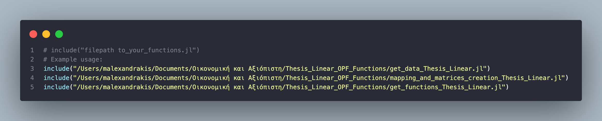
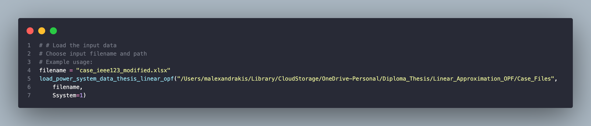
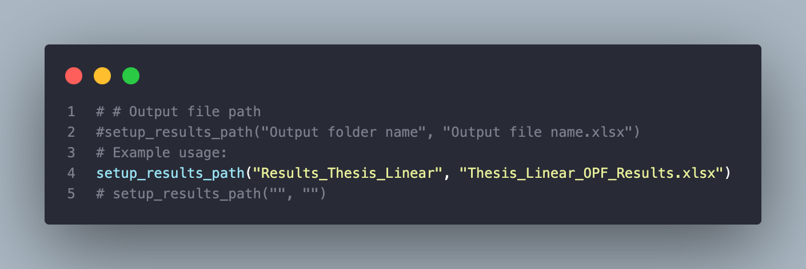
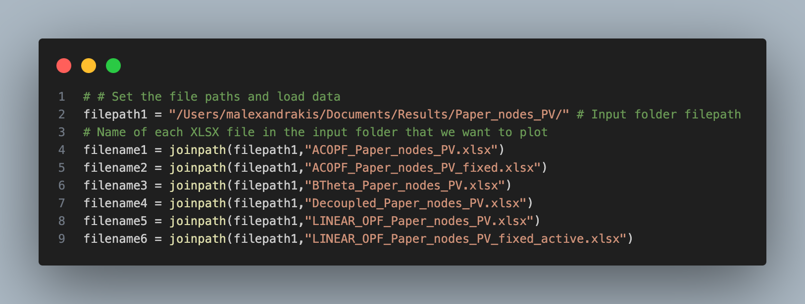
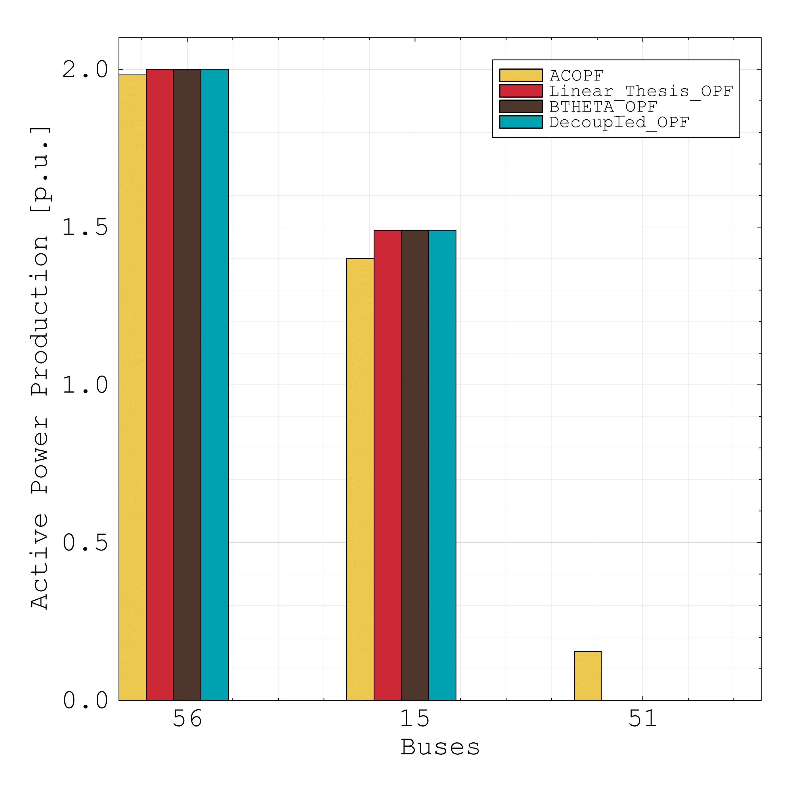
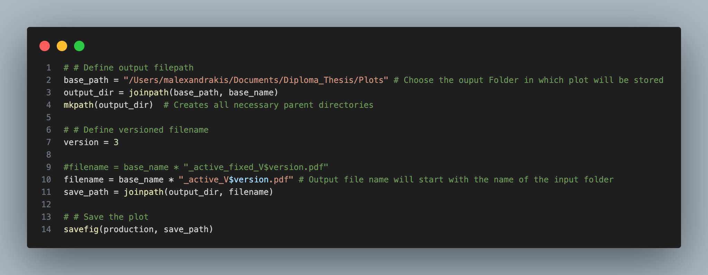

<h1 align="center">
  A Linear Approximation for the Optimal Power Flow Problem 
</h1> 


<p align="center">
  <a href="https://github.com/ManousosAlexandrakis/Linear_Approximation_OPF" title="Linear_Approximation_OPF">
    
  </a>
</p>


# Repository's purpose
This repository contains a linear model for the approximation of the Optimal Power Flow (OPF) problem, developed as part of the diploma thesis of Manousos Alexandrakis under the supervision of [Prof. Anthony Papavasiliou](https://ap-rg.eu/) and Zejun Ruan. It includes implementation code, case files in XLSX format, and code for plotting results. Additionally, implementation code for DC BTheta and Decoupled OPF models is included.


# Thesis Presentation

📄 You can view or download the full presentation as a PDF:
[View Thesis Presentation (PDF)](Thesis_presentation/Thesis_presentation_Manousos.pdf)


# Authors
This code was created by [Manousos Alexandrakis](https://github.com/ManousosAlexandrakis), [Lina Efthymiadou](https://github.com/lina-efthymiadou) and [Zejun Ruan](https://github.com/zejunr), listed in alphabetical order. The initial work was carried out by Zejun Ruan and Lina Efthymiadou, while Manousos Alexandrakis finalized the implementation.

For any questions or contributions, feel free to open an issue or submit a pull request.

# Files Explanation

- **Case_Files** → Contains input data for one energy system.
- **DC_BTheta_OPF_Functions:**
    1. [`create_matrices_DC_BTheta`](DC_BTheta_OPF_Functions/create_matrices_DC_BTheta.jl) → Creates Y and B matrices used in code.
    2. [`get_data_DC_BTheta`](DC_BTheta_OPF_Functions/get_data_DC_BTheta.jl) → Loads and analyzes the input data.
    3. [`get_functions_DC_BTheta`](DC_BTheta_OPF_Functions/get_functions_DC_BTheta.jl) → Contains functions for mathematical model creation, problem solving, result printing, and plot creation.
- **Decoupled_OPF_Functions:**
    1. [`create_matrices_Decoupled`](Decoupled_OPF_Functions/create_matrices_Decoupled.jl) → Creates Y and B matrices used in code.
    2. [`get_data_Decoupled`](Decoupled_OPF_Functions/get_data_Decoupled.jl) → Loads and analyzes the input data.
    3. [`get_functions_Decoupled`](Decoupled_OPF_Functions/get_functions_Decoupled.jl) → Contains functions for mathematical model creation, problem solving, result printing, and plot creation.
- **Thesis_Linear_OPF_Functions**:
    1. [`mapping_and_matrices_creation_Thesis_Linear`](Thesis_Linear_OPF_Functions/mapping_and_matrices_creation_Thesis_Linear.jl) → Maps the buses and creates the Y and Z matrices.
    2. [`get_data_Thesis_Linear`](Thesis_Linear_OPF_Functions/get_data_Thesis_Linear.jl) → Loads and analyzes the input data.
    3. [`get_functions_Thesis_Linear`](Thesis_Linear_OPF_Functions/get_functions_Thesis_Linear.jl) → Contains functions for mathematical model creation, problem solving, result printing, and plot creation.
- **main_code:** 
  1. [`Thesis_Linear_OPF_main`](main_code/Thesis_Linear_OPF_main.jl) → Runs the proposed linear model.
  2. [`DC_Btheta_OPF_main`](main_code/DC_Btheta_OPF_main.jl) → Runs the BTheta model.
  3. [`Decoupled_OPF_main`](main_code/Decoupled_OPF_main.jl) → Runs the Decoupled model.

The [`main_code`](main_code) folder contains standalone scripts that run the entire problem without using modularized functions. The codes are written in a fully expanded form for clarity and completeness.

- **Plotting_Scripts →** Creates visualizations for all models (including the ACOPF model, which is not included in this repository).

- **Resources →** Contains images used in readme file.

- **Thesis_Linear_OPF_conv**, **DC_BTheta_OPF_conv**, **Decoupled_OPF_conv**:
  - These scripts provide an easier and more organized way to run the Thesis Linear, BTheta and Decoupled OPF models, respectively, based on the modular functions from their     corresponding folders.
  - You can specify the XLSX output filename and file path for saving results.
  - Plots are automatically generated; figure appearance can be customized by adjusting the `zoom_out` and `y_ticks_range` parameters.


# Simple Instructions
To run this project, you’ll need to have the Julia programming language installed, along with a few required packages. Although any IDE will work, this project was developed using Visual Studio Code with the Julia extension.

## Setup Steps
1. **Install Julia:** 
Download and install [Julia application](https://julialang.org/downloads) 

2. **Open the Project in VS Code (or your preferred IDE):**
Make sure you have the Julia extension installed in VS Code for best support.

3. **Install Required Packages:**
Open the Julia REPL (terminal) in VS Code, then enter package mode by typing:
```
]
```
Then, install the necessary packages by typing:
```
add PackageName
```
Replace **`PackageName`** with each package required for this project.

**Required Packages:** DataFrames, JuMP, Gurobi, LinearAlgebra, XLSX, Plots, Printf

4. **Install an Optimizer**

This project uses the **Gurobi Optimizer**, a powerful commercial solver. To use Gurobi, make sure you have:

- A valid **Gurobi license** (Free academic licenses are available)
- The **[Gurobi application](https://www.gurobi.com/downloads/gurobi-software/)** installed on your system
- The **Gurobi Julia package** added to your environment (add Gurobi package as shown in step 3)

To install the package in Julia, open the Julia REPL and enter:

```julia
] add Gurobi
```
### Note: Using Gurobi in Your Code

After installing Gurobi, you can initialize and use it as your solver with the following setup:

```julia
# Create a mathematical optimization model using the Gurobi Optimizer as the solver
GUROBI_ENV = Gurobi.Env()
model = Model(() -> Gurobi.Optimizer(GUROBI_ENV))
set_optimizer_attribute(model, "MIPGap", 0.0) 
set_silent(model)
```


If you prefer a free and open-source alternative, you can use GLPK instead. It works well for most linear optimization problems. Install GLPK with:
```
] add GLPK
```
A list of solvers is available at [YALMIP](https://yalmip.github.io/allsolvers/)

## How to Run the Code: Step-by-Step
To run the code, you can use either the scripts in the main_code folder or the **Thesis_Linear_OPF_conv**, **DC_BTheta_OPF_conv** and **Decoupled_OPF_conv** files.
For an easier and smoother experience, it is recommended to use the **_conv** files.


1. The first step is to include the functions. To do this, use the filepath to the functions folder.
#### Example:



2. Load the input XLSX file. Fill in the filename and the filepath in the appropriate sections.
#### Example:


:warning: **Important note:** The format of file paths differs between operating systems. The examples shown are based on macOS; Windows users should adjust the paths accordingly (e.g., use double backslashes \ \ instead of forward slashes /). Make sure that the input case files follow the same formatting as the examples provided in the [`Case_Files`](./Case_Files) folder.

3. Choose the output folder name and the ouutput XLSX filename. The output folder will contain the plots and the XLSX file with results.
#### Example:


4. Fine-tune the plotting parameters. Adjust the values of **`zoom_out`** and **`yticks_range`** if needed for better figure appearance.

If the above steps are followed correctly, the code should run without issues.
The only reason for an error would typically be infeasibility in the optimization model.

### Example for running the code:
<p align="center">
  
</p>


## Plotting Scripts  

This folder contains scripts for generating visualizations in order to compare the results of the 4 different models.

### How to Plot: Step-by-Step
1. Make sure you load input data in the right way
#### Example for input 


2. Some parameters may require adjustment for optimal display:  

- **`yticks`** – Adjust if y-axis labels are poorly spaced or unclear.  
- **`zoom_out`** – Modify to control the zoom level of the plot.

### Plotting Example:
<p align="center">
  
</p>

After saving the figure as a PDF, it will look like this:


<p align="center">
  
</p>

More plotting examples can be found in the [`Example_Plots`](./Example_Plots) folder.


3. Make sure to save the plot to your desired folder with a filename of your choice.

#### Example for plot saving:



####  Notes  
- Ensure the input data is in the correct format before running.  
- Fine-tune parameters as needed for different datasets. 
- The palette used for plotting can be viewd here: https://www.color-hex.com/color-palette/894  


