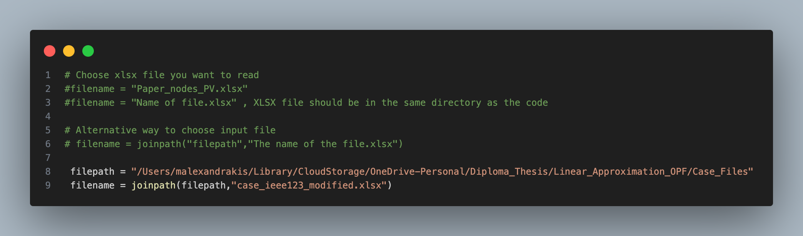
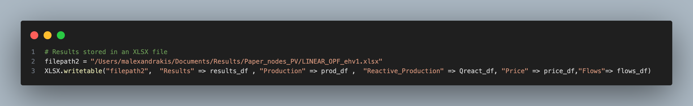

<h1 align="center">
  A Linear Approximation for the Optimal Power Flow Problem 
</h1> 

<p align="center">
  <a href="https://github.com/ManousosAlexandrakis/Linear_Approximation_OPF" title="Linear_Approximation_OPF">
    
  </a>
</p>

## Repository's purpose
This repository contains a linear model for the approximation of the Optimal Power Flow (OPF) problem, developed as part of my diploma thesis under the supervision of Anthony Papavasiliou and ZeJun Ruan. It includes implementation code, case files in XLSX format, and code for plotting results. Additionally, implementation code for DCOPF and Decoupled OPF models is included.

## Authors
This code was created by [Manousos Alexandrakis](https://github.com/ManousosAlexandrakis), [Lina Efthymiadou](https://github.com/lina-efthymiadou), [ZeJun Ruan](https://github.com/zejunr), listed in alphabetical order. The initial work was carried out by ZeJun Ruan and Lina Efthymiadou, while Manousos Alexandrakis finalized the implementation.

For any questions or contributions, feel free to open an issue or submit a pull request.

## Files Explanation

- **Linear_OPF_Final**: Generates results for the proposed linear model.  
- **OPF_Decoupled**: Generates results for the decoupled model.  
- **DCOPF_BTheta**: Generates results for the BTheta model.  
- **Plotting_Scripts**: Creates visualizations for all models (including the ACOPF model, which is not included in this repository).  
- **Case_Files**: Contains input data for one energy system.  


## Simple Instructions
To run this project, you’ll need to have the Julia programming language installed, along with a few required packages. Although any IDE will work, this project was developed using Visual Studio Code with the Julia extension.

### Setup Steps
1. **Install Julia:** 
Download and install Julia from the official website: https://julialang.org/downloads

2. **Open the Project in VS Code (or your preferred IDE):**
Make sure you have the Julia extension installed in VS Code for best support.

3. **Install Required Packages:**
Open the Julia REPL (terminal) in VS Code, then enter package mode by typing:
```
]
```
Then, install the necessary packages by typing:
```
add PackageName
```
Replace **`PackageName`** with each package required for this project (e.g. Plots, JuMP, etc.).

### How to Run the Code
To ensure the code files run correctly, you must load the case files properly. There are two ways to do this:

1. **Use the full file path**  
2. **Use only the filename** (This works only if the case file is in the same directory as the code file.)

:warning: **Important note:** The format of file paths differs between operating systems. The examples shown are based on macOS; Windows users should adjust the paths accordingly (e.g., use double backslashes \ \ instead of forward slashes /).  
### Example:


The same approach applies to the output data XLSX file. 
### Example:


Make sure that the input case files follow the same formatting as the examples provided in the `Case_Files` folder.


If the above steps are followed correctly, the code file should run without issues—only infeasibility could cause an error.


## Plotting Scripts  

This folder contains scripts for generating visualizations from the code's output data.

### How to Plot: Step-by-Step
1. Make sure you load input data in the right way
#### Example for input 


2. Some parameters may require adjustment for optimal display:  

- **`yticks`** – Adjust if y-axis labels are poorly spaced or unclear.  
- **`zoom_out`** – Modify to control the zoom level of the plot.

### 📊 Example Plotting:
<p align="center">
  
</p>

3. Make sure to save the plot to your desired folder with a filename of your choice.
#### Example for plot saving:


#### 📌 Notes  
- Ensure the input data is in the correct format before running.  
- Fine-tune parameters as needed for different datasets. 
- The palette used can be viewd here: https://www.color-hex.com/color-palette/894  


